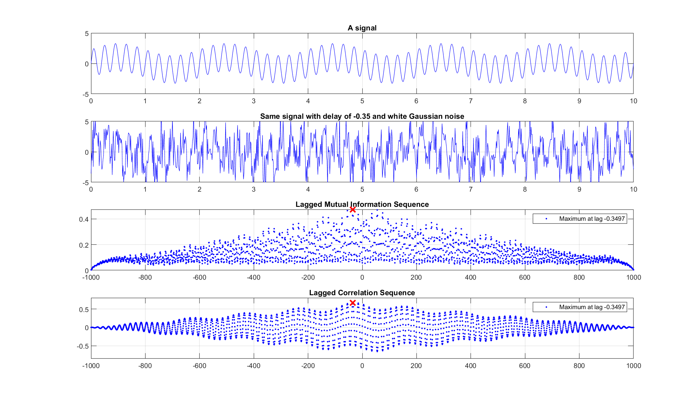

# mutual information and joint entropy
(computing the mutual information and the joint entropy of two signals)

First, let's create two signals:

    t = 0:10^-2:10;
    delay = .35;

    x = sin(pi*t) + 2.3*sin(10*pi*t);
    y = sin(pi*(t+delay)) + 2.3*sin(10*pi*(t+delay)) + 2*wgn(size(t,1),size(t,2),-10^(-100));

Then find the mutual information of `x` and lagged `y` for various lags, and find the max mutual information:

    nlags = length(t)-1;
    lags = -nlags:nlags;

    mil = zeros(size(lags));
    for i = 1:length(lags)
        disp(i)
        yl = lagmatrix(y,-lags(i));
        yl(isnan(yl)) = 0;
        mil(i) = mutual_information(x,yl,log2(1000));
    end
    [~,I1] = max(mil);

Do the same thing with cross correlation and find the max:
    
    [xc,~] = crosscorr(x,y,nlags);
    [~,I2] = max(abs(xc));

And then see how well we've done in either case:

 
